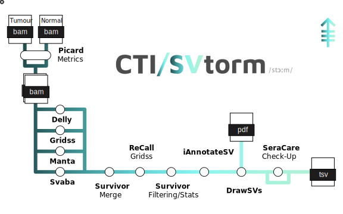

# jblancoheredia/svtorm

<h1>
  <picture>
    <source media="(prefers-color-scheme: dark)" srcset="assets/SVtorm_logo_dark.png">
    
  </picture>
</h1>

[](https://www.nextflow.io/)
[](https://docs.conda.io/en/latest/)
[](https://www.docker.com/)
[](https://sylabs.io/docs/)
[](https://cloud.seqera.io/launch?pipeline=https://github.com/mskcc/svtorm)

## Introduction

<picture>
  <source media="(prefers-color-scheme: dark)" srcset="assets/SVtorm_metro_dark.svg">
  
</picture>

**CTI/SVtorm** is a high-performance bioinformatics pipeline tailored to detect structural variants from targeted sequencing data. Optimized for ACCESSv2. SVtorm delivers sensitive and reliable SV calls from liquid biopsy samples. By integrating and harmonizing multiple cutting-edge callers, SVtorm generates clinically actionable results to support oncologists and inform precision treatment decisions, while also advancing translational research.

## Pipeline Steps

0. SVtorm starts with a couple of BAM files per sample, one for tumour and one for normal.
1. Collect stats for the input BAM files ([`Picard`](https://github.com/broadinstitute/picard/blob/master/src/main/java/picard/analysis/CollectMultipleMetrics.java))
2. Calling SVs
   - ([`Delly`](https://github.com/dellytools/delly))
   - ([`Svaba`](https://github.com/walaj/svaba))
   - ([`Manta`](https://github.com/Illumina/manta))
   - ([`Gridss`](https://github.com/PapenfussLab/gridss))
3. Merging Calls ([`SURVIVOR`](https://github.com/fritzsedlazeck/SURVIVOR))
4. ReCalling ([`Gridss`](https://github.com/PapenfussLab/gridss))
5. Filtering Calls ([`SURVIVOR`](https://github.com/fritzsedlazeck/SURVIVOR))
6. SVs Stats ([`SURVIVOR`](https://github.com/fritzsedlazeck/SURVIVOR))
7. Annotate SVs ([`iAnnotateSV`](https://github.com/mskcc/iAnnotateSV))
8. Draw SVs ([`DrawSV`](https://github.com/jblancoheredia/SVtorm/modules/local/DrawSV))
9. Check for expected SVs in Controls ([SeraCareCheckUp](https://github.com/jblancoheredia/SVtorm/modules/local/SeraCare/CheckUp))
10. Present QC for raw reads ([`MultiQC`](http://multiqc.info/)) 

## Usage

> [!NOTE]
> If you are new to Nextflow and nf-core, please refer to [this page](https://nf-co.re/docs/usage/installation) on how to set-up Nextflow. Make sure to [test your setup](https://nf-co.re/docs/usage/introduction#how-to-run-a-pipeline) with `-profile test` before running the workflow on actual data.
> [!NOTE]
> The best practice is to create a dedicated conda environment to install nf-core and Nextflow.

To run SVtorm follow these steps:

First, prepare the structure of the project, the ideal structure would be like follows:

<pre lang="md"> ``` PROJECT/ ├── 01_data/ │ ├── samples.csv │ ├── SAMPLE1_TUMOUR.bam │ ├── SAMPLE1_TUMOUR.bai │ ├── SAMPLE1_NORMAL.bam │ ├── SAMPLE1_NORMAL.bai │ ├── SAMPLE2_TUMOUR.bam │ └── SAMPLE2_TUMOUR.bai ├── 02_code/ │ └── run_SVtorm.sh ├── 03_outs/ ├── 04_logs/ ├── 05_work/ └── 06_cach/ ``` </pre>

Note: Any other structure is also possible, just adjust the launching script accordingly.

Second, prepare a samplesheet with your input data that looks as follows:

`samples.csv`:

```csv
patient,sample,bam,bai,tumour,matched
PATIENT1,SAMPLE1,/path/to/normal/bam/file/SAMPLE1_NORMAL.bam,/path/to/normal/bam/file/SAMPLE1_NORMAL.bai,false,true
PATIENT1,SAMPLE1,/path/to/tumour/bam/file/SAMPLE1_TUMOUR.bam,/path/to/tumour/bam/file/SAMPLE1_TUMOUR.bai,true,true
PATIENT2,SAMPLE2,/path/to/tumour/bam/file/SAMPLE2_TUMOUR.bam,/path/to/tumour/bam/file/SAMPLE2_TUMOUR.bai,true,false
```
Each row contains a sample BAM file and corresponding index file BAI, in the case of matched BAM available, will be determined by boolean 'matched' and the tumout quality by the  boolean 'tumour'. If not NORMAL is provided, a default putative NORMAL will be automatically used to accomplish the somatic callers needs.

Third, now you can run the pipeline using the assets/run_SVtorm.sh script as a template, such script is:

```bash
#!/bin/bash

source activate <conda env for nf-core>

export NXF_LOG_FILE="../04_logs/nextflow.log"
export NXF_CACHE_DIR="../06_cach/nextflow-cache"

nextflow run \
    /path/to/SVtorm/main.nf \
    --input ../01_data/samples.csv \
    --outdir ../03_outs/ \
    --email <user_name>@mskcc.org \
    -profile <crater/iris/juno> \
    -work-dir ../05_work \
    --seq_library Av2 \
    --genome HG19VS \
    -resume
```

> [!WARNING]
> Please provide pipeline parameters via the CLI or Nextflow `-params-file` option. Custom config files including those provided by the `-c` Nextflow option can be used to provide any configuration _**except for parameters**_; see [docs](https://nf-co.re/docs/usage/getting_started/configuration#custom-configuration-files).

## Credits

SVtorm was originally written by Juan Blanco-Heredia at the Marie-Josée and Henry R. Kravis Center for Molecular Oncology, Technology Innovation Lab, Memorial Sloan Kettering Cancer Center.

Main developer:

- [Juan Blanco-Heredia](blancoj@mskcc.org)

We thank the following people for their extensive assistance in the development of this pipeline:

- [Caryn Hale](halec@mskcc.org)
- [Eve Byington](byingte@mskcc.org)
- [Kanika Arora](AroraK@mskcc.org)
- [Rose Brannon](brannona@mskcc.org)
- [Satshil Rana](ranas@mskcc.org)
- [Shivani Guturu](guturus1@mskcc.org)

## Contributions and Support

If you would like to contribute to this pipeline, please see the [contributing guidelines](.github/CONTRIBUTING.md).

## Citations

An extensive list of references for the tools used by the pipeline can be found in the [`CITATIONS.md`](CITATIONS.md) file.

This pipeline uses code and infrastructure developed and maintained by the [nf-core](https://nf-co.re) community, reused here under the [MIT license](https://github.com/nf-core/tools/blob/main/LICENSE).

> **The nf-core framework for community-curated bioinformatics pipelines.**
>
> Philip Ewels, Alexander Peltzer, Sven Fillinger, Harshil Patel, Johannes Alneberg, Andreas Wilm, Maxime Ulysse Garcia, Paolo Di Tommaso & Sven Nahnsen.
>
> _Nat Biotechnol._ 2020 Feb 13. doi: [10.1038/s41587-020-0439-x](https://dx.doi.org/10.1038/s41587-020-0439-x).